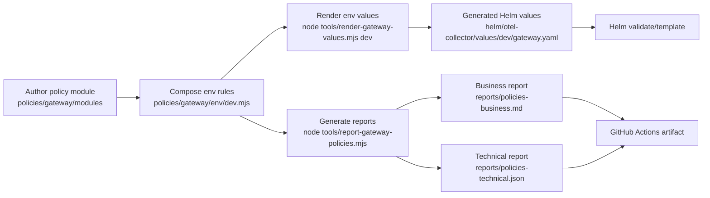

# Observability GitOps (OpenTelemetry Collector)

This repository deploys the OpenTelemetry Collector to Kubernetes via Argo CD in two modes:

1. Daemonset (agent on each node)
2. Gateway (deployment)

Both modes use a single wrapper chart and different values overrides.

## Layout

- `helm/otel-collector`  
  Wrapper chart that depends on `opentelemetry-collector` and hosts shared defaults.
- `manifests/argocd`  
  Argo CD ApplicationSet manifests:
  - `manifests/argocd/otel-collector-daemon-appset.yaml`
  - `manifests/argocd/otel-collector-gateway-appset.yaml`
- `helm/otel-collector/values/common`  
  Shared mode-level values (for example, the generic gateway pipeline).
- `helm/otel-collector/values/<env>`  
  Environment overrides (for example, sampling percentage).

## Upgrade OpenTelemetry Collector Chart

When upgrading the upstream `opentelemetry-collector` chart:

1. Update `helm/otel-collector/Chart.yaml`:
   - Bump `dependencies[].version` to the new chart version.
2. Update `helm/otel-collector/values.yaml`:
   - Align `opentelemetry-collector.image.tag` to the desired collector version.
3. Refresh the vendored dependency:
   - Run `helm dependency update` to regenerate `Chart.lock` and `charts/opentelemetry-collector-<version>.tgz`.

### Commands (PowerShell)

```powershell
cd D:\workspace\playground\open-telemetry-poc\observability-gitops
helm dependency update .\helm\otel-collector
```

### Validate Render (Dev)

```powershell
helm template otel-collector-daemon .\helm\otel-collector -f .\helm\otel-collector\values.yaml -f .\helm\otel-collector\values\dev\daemon.yaml
helm template otel-collector-gateway .\helm\otel-collector -f .\helm\otel-collector\values.yaml -f .\helm\otel-collector\values\common\gateway.yaml -f .\helm\otel-collector\values\dev\gateway.yaml
```

## Gateway Policy Model

Gateway collector settings are layered:

1. Base chart defaults: `helm/otel-collector/values.yaml`
2. Shared gateway policy: `helm/otel-collector/values/common/gateway.yaml`
3. Environment override: `helm/otel-collector/values/<env>/gateway.yaml`

This keeps a single generic gateway pipeline while allowing minimal per-environment differences.

### Enabled By Default In Shared Gateway Policy

Defined in `helm/otel-collector/values/common/gateway.yaml`:

1. Log noise filtering (`filter/logs_volume`)
2. Large log body replacement (`transform/log_body_limit`) with:
   `log message was too long and was blocked`
3. Sensitive key masking (`redaction.blocked_key_patterns`)
4. Sensitive value masking (`redaction.blocked_values`)
5. Tail sampling (baseline defaults to 100%, env-overridable)

### Environment-Specific Overrides

Keep these small and focused:

1. `dev`: baseline sampling is set to 50%
2. `sit`, `uat`, `prod`: baseline sampling is set to 10%
3. `prod`: traces and logs explicitly keep volume controls and redaction enabled in pipeline processors

### Modular Policy Authoring (Recommended)

To avoid managing all rules in one large YAML, define policy fragments and render env values files:

1. Reusable modules: `policies/gateway/modules/*.mjs`
2. Env composition: `policies/gateway/env/<env>.mjs`
3. Renderer: `tools/render-gateway-values.mjs`
4. Generated output: `helm/otel-collector/values/<env>/gateway.yaml`

Process flow:



Render examples:

```powershell
node .\tools\render-gateway-values.mjs dev
node .\tools\render-gateway-values.mjs sit
node .\tools\render-gateway-values.mjs uat
node .\tools\render-gateway-values.mjs prod
```

Dev currently includes an example service-level masking rule in the generated file:
- `order-service` log attribute `userEmail` is set to `[REDACTED]`.
- `payment-service` log body `clientId` value is scrubbed to `[REDACTED]` (including JSON-like message text patterns).

Typical change workflow for a new rule:

1. Add/update module logic in `policies/gateway/modules/*.mjs`.
2. Add rule metadata + fragment in `policies/gateway/env/<env>.mjs`.
3. Render values: `node .\tools\render-gateway-values.mjs <env>`.
4. Regenerate reports: `node .\tools\report-gateway-policies.mjs`.
5. Validate render: `helm template ... -f .\helm\otel-collector\values\<env>\gateway.yaml`.
6. Commit policy source + generated values + reports.

Generate policy reports:

```powershell
node .\tools\report-gateway-policies.mjs
```

Outputs:
- `reports/policies-business.md`
- `reports/policies-technical.json`

### Optional Targeted Rules

If specific services or namespaces are noisy, add OTTL filters in
`helm/otel-collector/values/<env>/gateway.yaml` using resource attributes, for example:

- `resource.attributes["k8s.namespace.name"]`
- `resource.attributes["service.name"]`

### Things to Watch

1. Values schema changes in the new chart (fields renamed/removed).
2. Default ports or receiver configs that might change.
3. Breaking changes in the collector config format.
4. Image tag does not always match chart version; verify release notes.

## Argo CD UI Note

Some environments restrict adding Helm parameters in the UI. This repo sets a default
`opentelemetry-collector.mode: daemonset` in `helm/otel-collector/values.yaml` so Application
creation succeeds without additional parameters. Gateway overrides set `mode: deployment`.

## Creating Apps In Argo CD (UI)

1. Open Argo CD and click **New App**.
2. Set:
   - **Application Name**: `otel-collector-daemon-dev` (or your naming standard)
   - **Project**: `default`
   - **Sync Policy**: `Automatic` (optional, but matches the ApplicationSets)
3. In **Source**:
   - **Repository URL**: your Git repo URL
   - **Revision**: `main`
   - **Path**: `helm/otel-collector`
4. In **Destination**:
   - **Cluster URL**: `https://kubernetes.default.svc`
   - **Namespace**: `observability-dev`
5. Click **Create**.

To create the gateway app, repeat the above and use a gateway values file override via
the ApplicationSet (recommended). If you must create it manually, use the same chart path
and ensure `opentelemetry-collector.mode` resolves to `deployment` via the gateway values file.

## Java Agent (PoC) - Example (order-service)

The application Helm charts (e.g., `order-service`) use an init container to
download the OpenTelemetry Java agent and `JAVA_TOOL_OPTIONS` to enable it.
This section mirrors the values and template style used by those charts.

### Values (app chart)

```yaml
otel:
  endpoint: "" # optional override
  collectorService: "otel-collector-daemon"
  collectorNamespace: "" # defaults to .Release.Namespace
  collectorPort: 4317
  protocol: "grpc"
  tracesExporter: "otlp"
  logsExporter: "otlp"
  metricsExporter: "otlp"
  logLevel: "debug"
```

### Deployment Template (app chart)

```yaml
initContainers:
  - name: otel-agent
    image: curlimages/curl:8.5.0
    command: ["sh", "-c"]
    args:
      - >
        curl -L
        https://github.com/open-telemetry/opentelemetry-java-instrumentation/releases/download/v2.20.1/opentelemetry-javaagent.jar
        -o /otel/javaagent.jar
    volumeMounts:
      - name: otel-agent
        mountPath: /otel

containers:
  - name: my-service
    env:
      - name: JAVA_TOOL_OPTIONS
        value: "-javaagent:/otel/javaagent.jar"
      - name: OTEL_SERVICE_NAME
        value: my-service
      - name: OTEL_EXPORTER_OTLP_ENDPOINT
        value: {{ default (printf "http://%s.%s.svc.cluster.local:%v" .Values.otel.collectorService (default .Release.Namespace .Values.otel.collectorNamespace) .Values.otel.collectorPort) .Values.otel.endpoint | quote }}
      - name: OTEL_EXPORTER_OTLP_PROTOCOL
        value: {{ .Values.otel.protocol }}
      - name: OTEL_TRACES_EXPORTER
        value: {{ .Values.otel.tracesExporter }}
      - name: OTEL_LOG_LEVEL
        value: {{ .Values.otel.logLevel }}
      - name: OTEL_LOGS_EXPORTER
        value: {{ .Values.otel.logsExporter }}
      - name: OTEL_METRICS_EXPORTER
        value: {{ .Values.otel.metricsExporter }}
    volumeMounts:
      - mountPath: /otel
        name: otel-agent

volumes:
  - name: otel-agent
    emptyDir: {}
```

### Notes

1. Daemonset deployment exposes a ClusterIP service named `otel-collector-daemon`.
2. Validate service presence per environment namespace:
   `kubectl get svc -n observability-dev otel-collector-daemon`
3. Application charts default OTLP endpoint to:
   `http://otel-collector-daemon.<release-namespace>.svc.cluster.local:4317`
4. Override `otel.endpoint` only when you intentionally need a different target.
5. If you pin the agent version, update the URL in the init container.

## New Relic Secret

Gateway collector expects a Kubernetes secret named `newrelic-otlp` in each
`observability-<env>` namespace with key `api-key`:

```bash
kubectl -n observability-dev create secret generic newrelic-otlp \
  --from-literal=api-key="<YOUR_NR_API_KEY>"
```

## Daemon Service Alias

When collector release naming differs from `otel-collector-daemon`, apply the alias Service:

```bash
kubectl apply -f k8s/observability-dev/otel-collector-daemon-service.yaml
```
